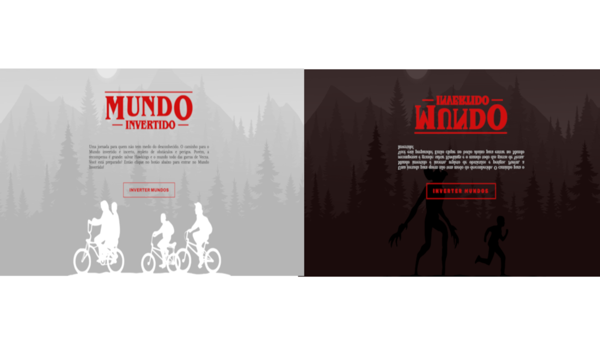

# O Mundo Invertido

O Mundo Invertido é uma experiência web criada com HTML, CSS e JavaScript. O objetivo do projeto é criar uma jornada para o usuário que não tem medo do desconhecido, onde ele deve lidar com obstáculos e perigos para salvar Hawkings e o mundo todo das garras de Vecna.

## Tecnologias Usadas

- HTML
- CSS
- JavaScript

## Design e UI/UX

O design do site é inspirado no estilo de Stranger Things, com um tom sombrio e assustador. As imagens são usadas para criar uma atmosfera de suspense e tensão, enquanto as cores são escolhidas para refletir a paleta de cor da série.

## Contribuir para o Projeto

Obrigado por considerar contribuir para O Mundo Invertido! Para contribuir, siga os seguintes passos:

1.  Crie uma nova branch com **git checkout -b nome-da-branch**
2.  Faça as alterações necessárias.
3.  Confirme as alterações com **git add**.
4.  Envia a commit usando **git commit -m "mensagem-da-commmit"**
5.  Crie um pull request no GitHub/ GitLab.

## Muito obrigado por visitar O Mundo Invertido!

Espero que isso tenha ajudado! Se tiver alguma dúvida ou precisar de mais ajuda, sinta-se à vontade para perguntar.
